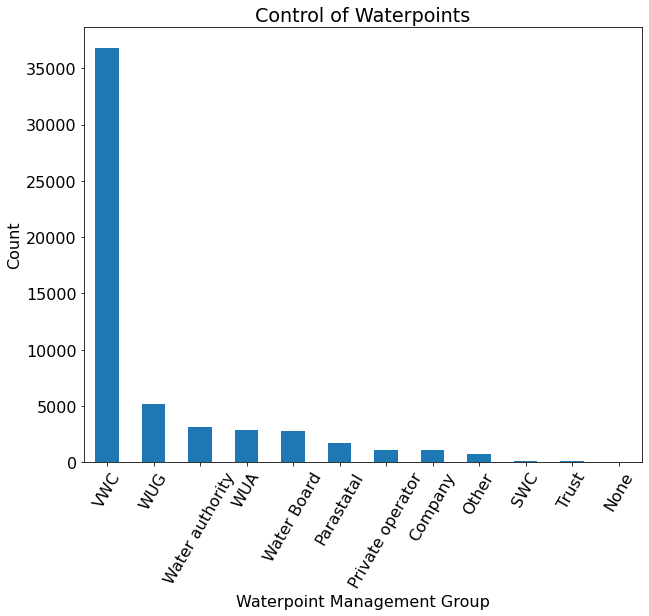
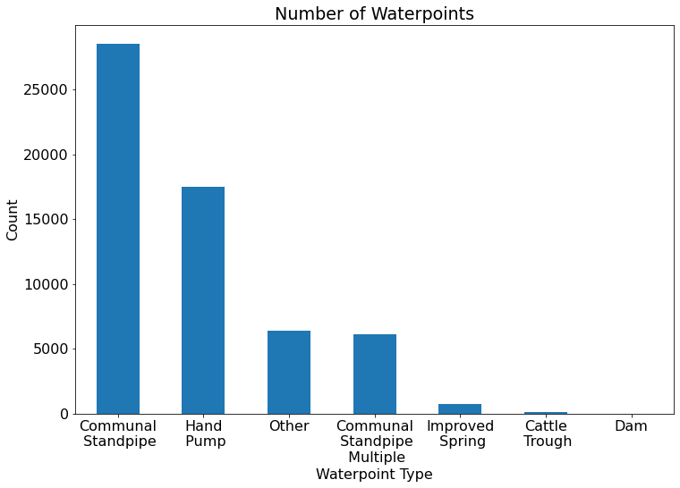
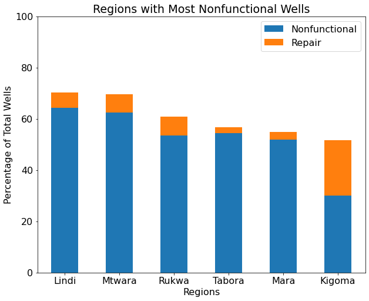
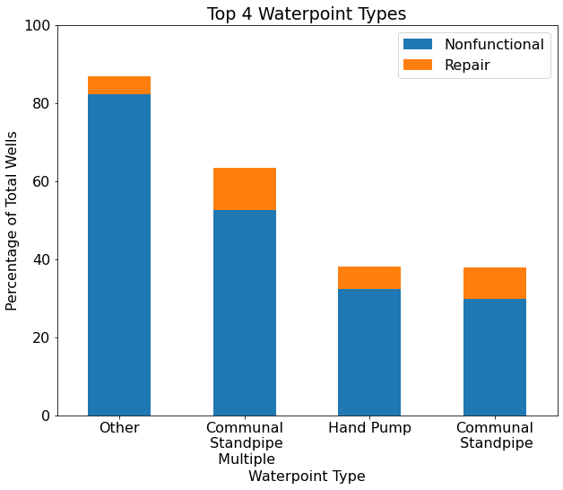
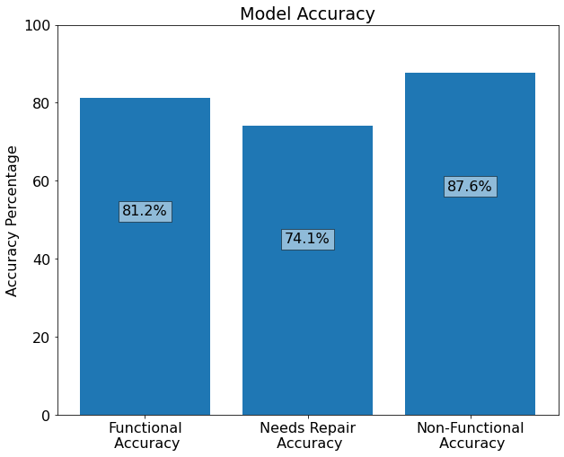

# Tanzanian-Water-Pumps-ML

Flatiron School Data Science Phase 3 Project
Author: Brandon Sienkiewicz

# Overview

Over sixty-one million people currently reside in Tanzania and, as a developing nation, access to clean water has become a major concern. Tanzania has a history of limited access to clean water sources and water sanitation resourses. This especially holds true for rural populations. There have been efforts in recent years in order to improve the water infrastructure, there is still much work to be done to bring clean water resources to the people of Tanzania. In addition to the issues with the overall infrastructure, maintainence of water wells has also proven to be an issue. Due to low tariffs and poor efficiency, many water wells need repaired or have completely failed. This is a glaring issue. If infrastructure improves but there is no way to maintain water wells, then the situation in Tanzania will not vastly improve.

## Business Understanding

As mentioned above, access to clean water in Tanzania is a major issue and the upkeep of wells is an issue that needs to be tackled first. In order to tackle this problem, we need to locate the wells in need of repair. My goal is to create a model that can accurately predict the location of wells in need of repair. This model will provide a more thoughrough understanding of which points will fail and will allow for better overall maintenance operations. This will help to limit NGO resources as well as provide a larger impact on providing clean water to the people of Tanzania. To achieve this goal, I utilized data from Taarifa and the Tanzanian Ministry of Water to create machine learning models that predict the state of wells throughout Tanzania.

## Data Understanding

The data set from Taarifa and the Tanzanian Ministry of Water included multiple features relating to location of the wells, what kind of pump is operating, how the well is managed, and when it was installed. Many of these features contain duplicate or redundant data; therefore, only one of the features was utilized to capture the data. There were also some features which did not have an adequate description and were therefore not included (example: num_private). After dropping all of this data, the final dataset was complete.

## Exploratory Data Analysis

Using the final dataset, multiple DataFrames were created in order do some exploratory data analysis. These new DataFrames were used to examine the count of the categorical features and to compare the categorical features to the waterpoint status, functional, in need of repair, or nonfunctional. In  order to quickly see which of the features to focus on, simple visualizations were created. Using these visualizations, the most important features were then selected and utilized to make visualizations that were suitable for the final presentation. These visualizations included a bar graph of the count of the water management groups, a bar graph of the count of the waterpoint types, a stacked bar plot of the proportion of nonfunctional and in need of repair well in the regions with the most nonfunctional wells, and a stacked bar plot of nonfunctional and in need of repair wells for the top four waterpoint types. These visualizations were used to provide recommendations to the stakeholder independent of the model and will be detailed in the "Results and Evaluation" section. The visualizations are also provided below.

## Data Modelling

Now that the EDA has been completed, it is time to begin the modelling process. The process began with created a Basline model which predicted Functional every time. This model performed at roughly 54.3% accuracy. The next step was to final a first simple model which improved on the results of this baseline model. A list of models was created to find which model performed the best. The following classifier models were used: logistic regression, K-nearest neighbors, decision trees, random forests, gradient boosting, adaboosting, and xgboosting. Overall, the best performing models were the random forest model, with an accuracy of 78.7%, and xgboost, with an accuracy of 78.1%. Given the time restraints of the project, the random forest model was the only model that was tuned for optimal results. After much model tuning, a model with an accuracy of 79.7%.

Using the final model, predictions were made on the training data as well as the testing data, through submitting the results on the competition page, [located here](https://link-url-here.org). The submission showed that the model performed at 79.1% accuracy when predicting the test data. This is fairly close to the accuracy on the training data and, therefore, appears to be a good fit (not under-fit or over-fit). Finally, the predictions on the training data were used to create a visualization showing the accuracy on each of the three status groups. The model predicted 81.2% of functional wells correctly, 74.1% of wells in need of repair correctly, and 87.6% of nonfunctional wells correctly. The visualization is shown below. This shows the models use given the business problem, as the accuracy of predicting nonfunctional wells is the most important. (Note: Predicting nonfunctional wells is deemed more important that predicting wells in need of repair as the nonfunctional wells represent a much larger proportion of the data, 38% compared to only 7%) This model gives the NGO a fairly accurate predictor of the status of future well data.

## Results and Evaluation

Overall, the EDA and model provided a good basis for recommendations to an NGO seeking to repair and replace waterpoints in Tanzania. The graphs created in the EDA showed that some important factors for the NGO to consider are the regions in which to work, important organizations to collaborate with, and which waterpoint types need replacing and are the most effective. The top five regions with the highest proportion of Non-Functional wells, Lindi, Mtwara, Tabora, Rukwa, and Mara, as well as the region with the highest number of wells in need of repair, Kigoma, were considered to be the best starting points in the NGO's efforts. In addition, VWC, the Village Water Committee, appears to control appears to control roughly 66% of the waterpoints provided in this dataset. Therefore, building a positive relationship with this organization is key for a successful project. The waterpoint type was also examined. The results showed that multiple communal standpipes and waterpoints classified as 'other' were not reliable, while single communal standpipes and hand pumps appear to be much more reliable. Finally, the model performed at 87.6% when predicting Nonfunctional wells which will aid in predicting nonfunctional wells in the future.

## Conclusion

Overall, this EDA and modelling were able to provide solid recommendations to an NGO seeking to repair and replace wells in Tanzania. The EDA was used to give recommendations to the NGO independant of the model and then the model was created to predict on future unknown data. A baseline model was constructed using a DummyClassifier and then, after testing multiple models, a RandomForestClassifier was chosen as it performed the best. This model was then tuned into the final model which did a solid job of predicting the target.